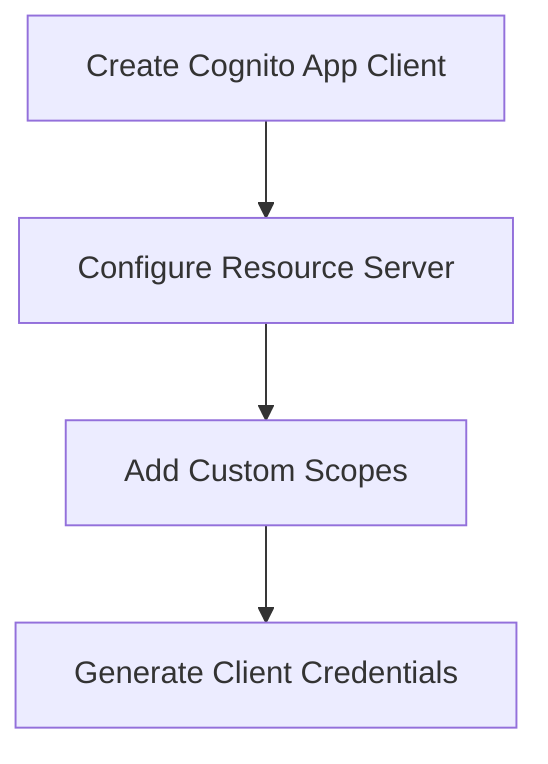
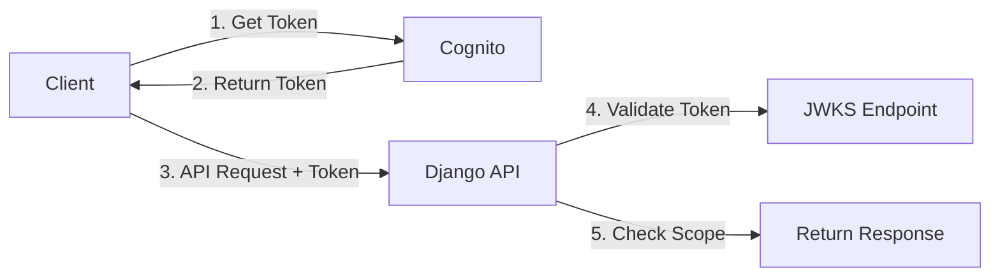

  

## Overview

The Drone Insurance Calculator is a Django application for calculating drone insurance premiums with support for multiple customers, European coverage, and casco insurance options.

  

## Features

- Customer-specific insured amount caps

- Premium calculations for 1M and 2M liability

- European coverage surcharge

- Casco (all-risk) insurance

- Admin interface for rate management

  

## Authentication Flow

  

### 1. Cognito Setup



  

1. **Resource Server Setup**

   - Name: `RekenboxResourceServer`

   - Add scope: `alicia.read`

  

2. **App Client Configuration**

   - Create new app client in Cognito

   - Enable client credentials flow

   - Add scope: `RekenboxResourceServer/alicia.read`

  

### 2. Permission Implementation

The `AliciaPermission` class validates tokens:

  

```python

class AliciaPermission(BasePermission):

    def has_permission(self, request, view):

        # Verify token has correct scope

        scopes = get_token_scopes(decoded_token)

        for scope in scopes:

            if scope == "RekenboxResourceServer/alicia.read":

                return True

        return False

```

  

### 3. API Authentication Flow



  

## Adding a New Customer

  

1. **Update Settings**

```python

# settings.py

CUSTOMER_CAPS = {

    "alicia": 5000,

    "new_customer": 10000  # Add new customer cap

}

```

  

2. **Configure Cognito**

- Create new app client for customer (This can be done manually through the AWS console, but its highly recommended to add a new App client thorugh CDK, and rebuild the stacks)

- Add scope: `RekenboxResourceServer/new_customer.read`

  

3. **Create new Permission Class in auth.py**

```python

class new_customerPermission(BasePermission):

    def has_permission(self, request, view):

        scopes = get_token_scopes(decoded_token)

        for scope in scopes:

            if scope == "RekenboxResourceServer/new_customer.read":

                return True  # Add new scope

        return False

```

  

4. **Test Setup**

```python

# test_views.py

def setUp(self):

    settings.CUSTOMER_CAPS = {

        'test_customer': 10000,

        'new_customer': 5000  # Add test customer cap

    }

```

  

## API Endpoints

  

### GET `/drone/<customer>/quote`

Retrieve available insurance rates and configuration.

  

**Response:**

```json

{

    "all_insurance_data": [

        {

            "verzekerd_bedrag": 1000,

            "aansprakelijkheid_1mio": 425,

            "aansprakelijkheid_2mio": 550,

            "eigen_risico": 250

        }

    ],

    "europe_surcharge": 1.15,

    "casco_rate": 0.07,

    "customer_cap": 5000

}

```

  

### POST `/drone/<customer>/quote`

Calculate insurance premium.

  

**Request:**

```json

{

    "verzekerd_bedrag": 5000,

    "europa": true,

    "casco": true,

    "aansprakelijkheid": 1

}

```

  

## Management Commands

  

```bash

# Populate drone rates

python manage.py populate_drone_rates

  

# Populate calculation config

python manage.py populate_calculation_config

```

  

## Testing

Run tests with:

```bash

python manage.py test drone_2025_simpel.test_views

python manage.py test drone_2025_simpel.test_models

```

  

## Admin Interface

  

### Upload Drone Rates via Excel

1. **Sheet Name Requirements**

   - Excel sheet must be named exactly: `premie tarieven`

  

2. **Required Column Headers**

   ```python

   required_columns = [

       "Verzekerd bedrag Casco / Payload",

       "Verzekerd bedrag Aansprakelijkheid = 1Mio",

       "Verzekerd bedrag Aansprakelijkheid = 2Mio",

       "Eigen risico"

   ]

   ```

  

   > Note: Column structure can be modified in `drone_2025_simpel/admin.py`

  

### Additional Admin Features

- Manage calculation variables (casco rates, surcharges)

- View and edit existing premium records

- Export data in various formats (CSV, Excel)

  

### Admin Access

1. Navigate to `/admin`

2. Login with superuser credentials

3. Select 'Drone Insurance Premiums' from the menu

  

Remember to:

1. Keep customer caps in sync across environments

2. Update tests when adding new customers and making changes to calculations, otherwise the build might fail

3. Document new scopes in team documentation

4. Test token generation and validation for new clients